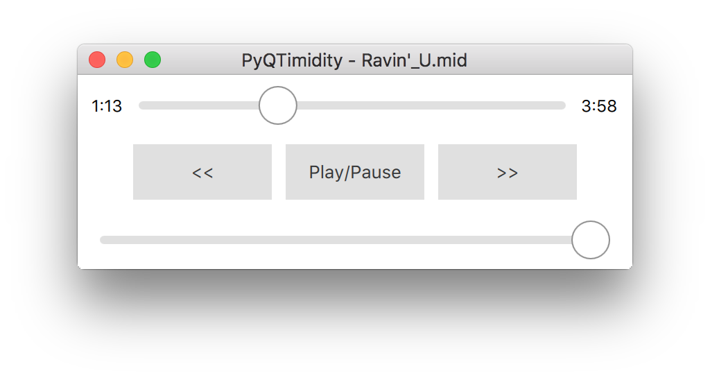

PyQTimidity
===========

A small macOS GUI of TiMidity++ for playing midi files supporting SoundFont switching.

TiMidity++ を使って MIDI ファイルを再生するための macOS 用 GUI. 再生に使用するサウンドフォントファイルの切り替えにも対応.

Usage
-----

*  先に TiMidity++ をインストールしておいてください.
    -  [Homebrew](https://brew.sh/index_ja.html) を使えば、`brew install timidity` で完了します.
    
*  後は、PyQTimidity を起動して MIDI ファイルを読み込めば OK です.
    -  PyQTimidity は標準で `/usr/local/bin/timidity` を読み込もうとします. これを変更する場合には、PyQTimidity の初回起動時に生成される `~/.py-qtimidity-pref.json` の `"TIMIDITY_LOCATION"` の値を書き換えてください.
    
*  Preferences から読み込む `timidity.cfg` ファイルを切り替えたり、SF2 形式の SoundFont ファイルを直接再生に使用するように指定できます.
    
Shortcuts
---------

*  `Command + O`
    -  ファイルを開く
*  `Space`
    -  再生開始 / 一時停止
*  `Left`
    -  10 秒前に戻す
*  `Right`
    -  10 秒先に進む
*  `Up`
    -  音量を上げる
*  `Bottom`
    -  音量を下げる
*  `Command + Option + L`
    -  ループ再生の ON / OFF

Development
-----------

*  Python version
    -  3.5.2
*  Qt5 version
    -  5.9.2
*  PyQt5 version
    -  5.9.1
*  PyInstaller version
    -  3.3

License
-------

*  GPL 3.0
